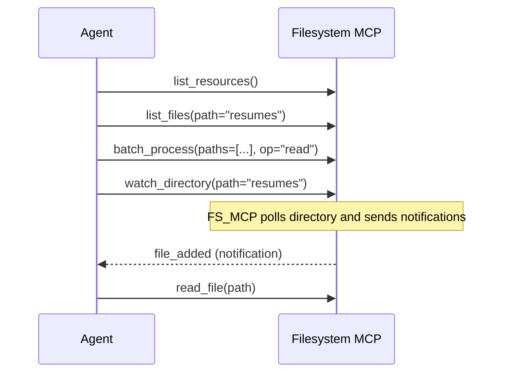
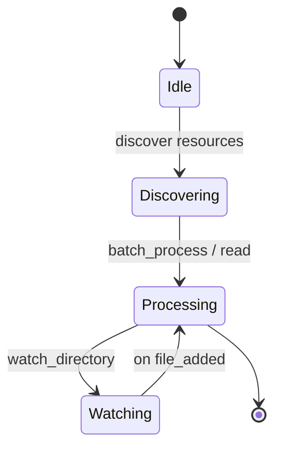

# mcp-filesystem

This package contains a JSON-RPC 2.0 Model Context Protocol (MCP) filesystem
server and a refactored agent that connects to MCP servers instead of using
local filesystem tools.

Quick start

Create and activate a virtual environment (Windows example):

```powershell
python -m venv venv
venv\Scripts\activate.bat
```

Run the server and the agent demo in separate terminals:

```powershell
# start server
python mcp-filesystem/src/server/filesystem_mcp_server.py

# in another terminal, run the agent demo
python mcp-filesystem/src/agent/matching_agent.py
```

**Workflow (agent ↔ MCP)**



State diagram (high-level)



Tests / Demo

- `mcp-filesystem/tests/demo_test.py` starts the server in-process and runs the
  `MultiMCPAgent` demo workflow to exercise `batch_process` and `watch_directory`.

Deliverables

- `src/server/filesystem_mcp_server.py` — JSON-RPC 2.0 MCP server
- `src/agent/matching_agent.py` — agent refactored to use MCP clients
- `config.json` — server configuration
- `requirements.txt` — dependency notes

Server start

```powershell
python mcp-filesystem/src/server/filesystem_mcp_server.py
```

Agent demo

```powershell
python mcp-filesystem/src/agent/matching_agent.py --action list
```

Agent actions

```powershell
python mcp-filesystem/src/agent/matching_agent.py --action list
python mcp-filesystem/src/agent/matching_agent.py --action read --filename sample_resume.txt
python mcp-filesystem/src/agent/matching_agent.py --action create --filename new_resume.txt --content "Name: Alice\nSkills: Python"
```

CLI alternative

```powershell
python mcp-filesystem/cli.py list
python mcp-filesystem/cli.py read sample_resume.txt
python mcp-filesystem/cli.py save new_resume.txt "Name: Alice\nSkills: Python"
```

Server features (implementation: filesystem_mcp_server.py)

- Protocol: JSON-RPC 2.0 over newline-delimited JSON (TCP).
- Transport: TCP socket server (configurable `host`/`port`).
- Config management: `get_config` and `reload_config` using `config.json`.
- Root scoping / security: Path resolution prevents escaping the configured root.
- Basic FS methods: `list_files`, `read_file`, `write_file`, `exists`, `stat`.
- Batch processing: `batch_process(paths, op)` for concurrent reads/stats across multiple files.
- Directory watch: `watch_directory` / `unwatch_directory` with polling-based detection and `file_added` notifications.
- Notifications: JSON-RPC notifications sent to subscribed clients (method `file_added`).
- Resource discovery: `list_resources` returns available methods / service metadata.
- Error handling: JSON-RPC-compliant error codes and structured error responses (parse/invalid/method/runtime).
- Concurrency & lifecycle: Async server using asyncio; handles multiple clients and long-running watcher task.
- Extensibility: Designed for adding more MCP capabilities (e.g., other resource endpoints or external MCP integrations).

Client API (methods clients can call)

- `list_files(path)` -> `['name1', 'name2', ...]`
- `read_file(path)` -> file contents (string)
- `write_file(path, content)` -> `true` on success
- `exists(path)` -> `true|false`
- `stat(path)` -> `{ size, mtime, is_file, is_dir }`
- `batch_process(paths, op)` -> concurrent `read` or `stat` across paths, returns map `path->result`
- `list_resources()` -> discovery metadata `{ service, root, methods }`
- `get_config()` / `reload_config()` -> config management
- `watch_directory(path, recursive=false)` -> subscribe; server sends `file_added` notifications
- `unwatch_directory(path)` -> unsubscribe

Notifications sent by server

- `file_added` (notification, no `id`): `{ path: '<watched-abs-path>', name: 'newfile.txt' }`

Example JSON-RPC request

```json
{"jsonrpc":"2.0","id":1,"method":"list_files","params":{"path":"resumes"}}
```

Example notification (from server)

```json
{"jsonrpc":"2.0","method":"file_added","params":{"path":"C:\\...\\data\\resumes","name":"new_resume.txt"}}
```

Notes / next steps

- Replace polling with `watchdog` for event-driven notifications in production.
- Add authentication/ACLs for multi-user safety.
- Add typed API docs or OpenAPI-style schema for clients.